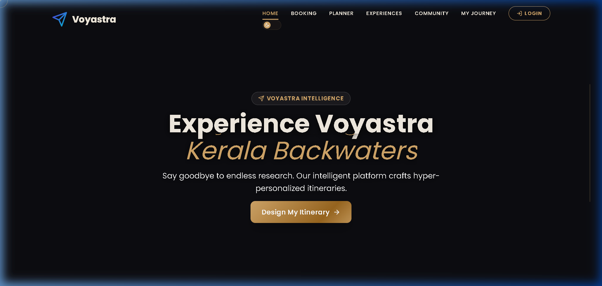
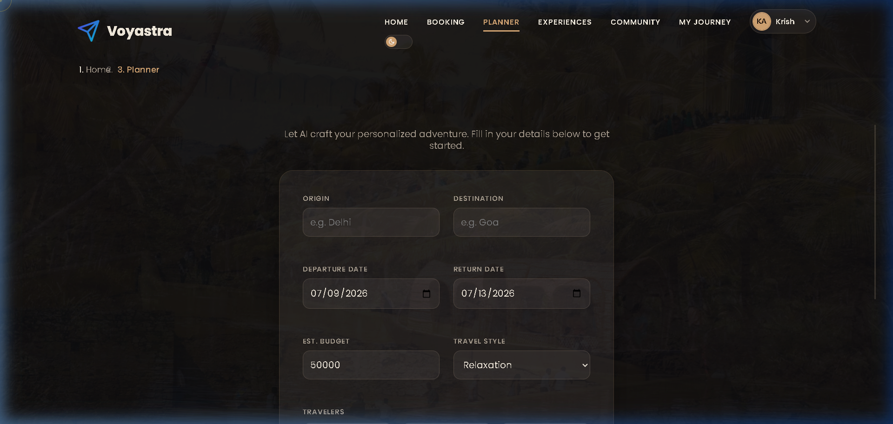
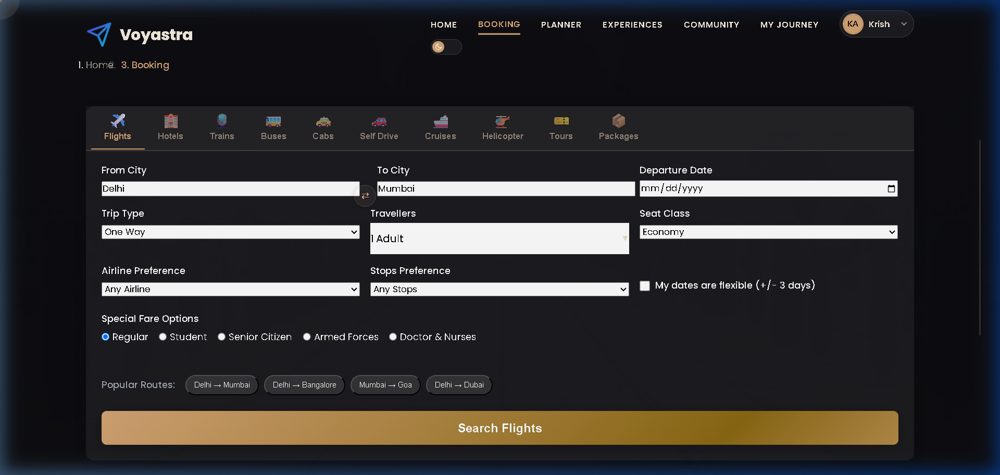
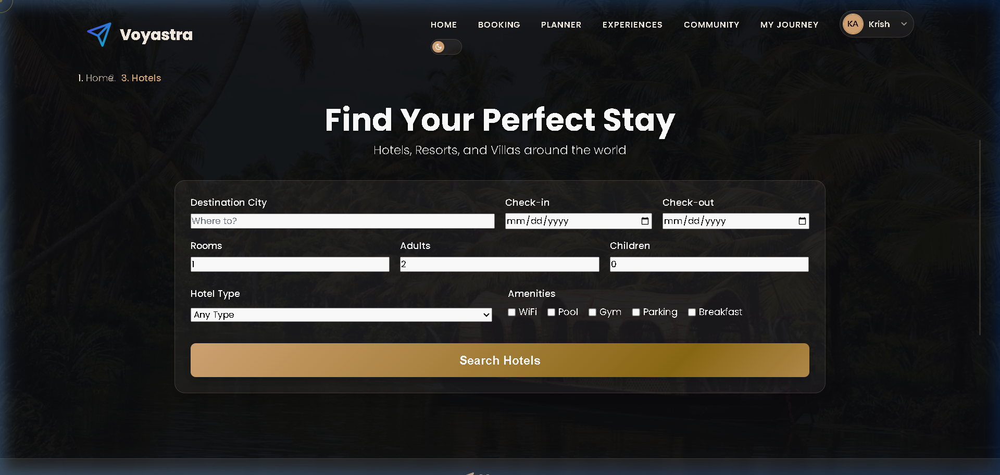
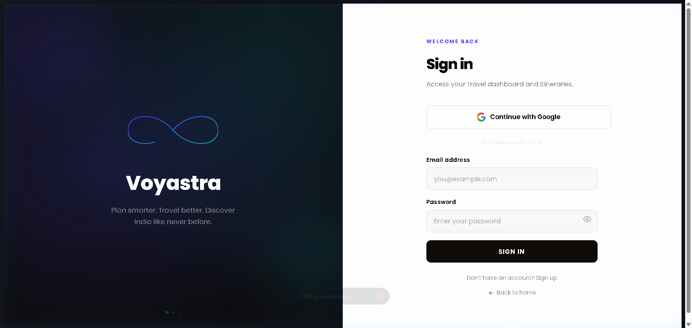
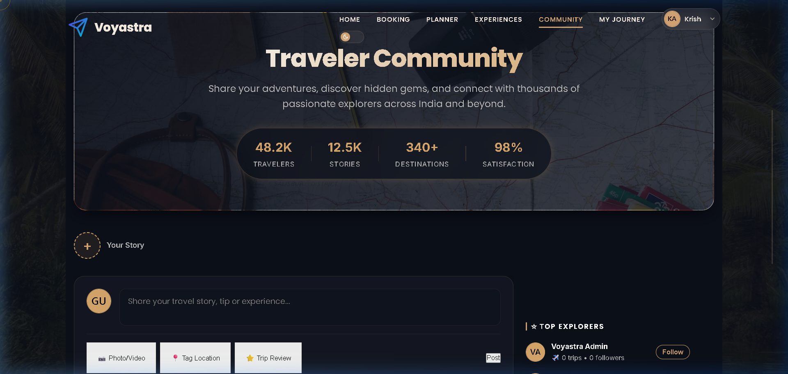
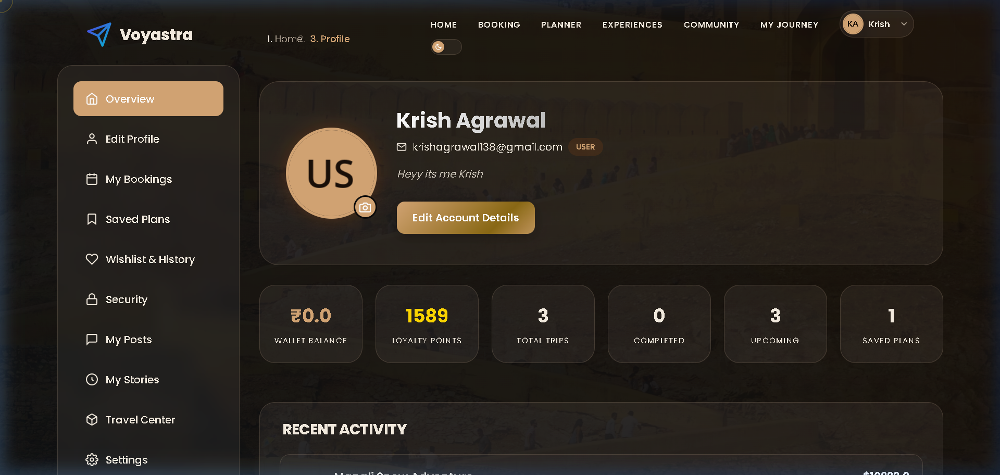
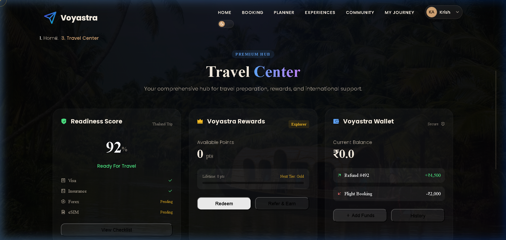
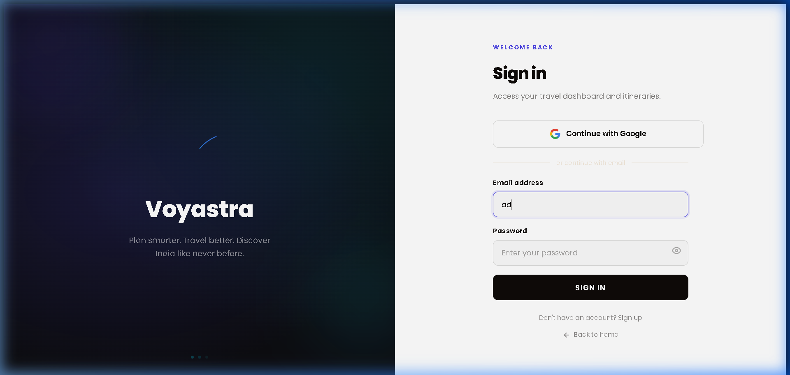

<div align="center">

# ✈️ Voyastra — Travel Smarter

**An AI-powered, full-stack travel platform built with pure Java Servlets & JSP.**  
Book flights, hotels, trains & more — powered by Google Gemini AI, Razorpay payments, and a vibrant travel community.

<br/>

[](https://openjdk.org/)
[](https://jakarta.ee/)
[](https://www.mysql.com/)
[](https://deepmind.google/technologies/gemini/)
[](https://razorpay.com/)
[](./LICENSE)

[](#)
[](#-project-structure)
[](#-project-structure)
[](#-apis-used)
[](https://github.com/krrrish111/Smart-Travel/stargazers)

</div>

---

## 🚀 Live Demo

> 🌐 **[voyastra.onrender.com](https://voyastra.onrender.com)** — Deployed on Render with Aiven MySQL

---

## ✨ Features

| | Feature | Description |
|---|---|---|
| 🤖 | **AI Trip Planner** | Gemini-powered day-by-day itineraries with budget breakdown |
| ✈️ | **Flight Search & Booking** | Full flow: Search → Seats → Payment → PDF Ticket |
| 🏨 | **Hotel Search** | Gallery, amenities, reviews, Google Maps, and Razorpay checkout |
| 🚆 | **Multi-Modal Transport** | Trains, buses, cabs, car rentals, cruises, helicopters |
| 🌍 | **Destination Explorer** | Featured destinations with weather, highlights & AI itinerary preview |
| 🗺️ | **Google Maps Integration** | Embedded maps and Places Autocomplete across 15+ inputs |
| 👥 | **Community Feed** | Travel stories, posts, reels, hidden gems & travel guides |
| 🧳 | **Travel Center** | Visa, Insurance, Forex, eSIM, Airport services |
| 💳 | **Razorpay Payments** | Secure payment gateway with PDF tickets and email confirmation |
| 👤 | **User Dashboard** | Bookings, wallet, loyalty points, wishlist & journey tracker |
| 🛡️ | **Secure Authentication** | BCrypt passwords + Google OAuth 2.0 + email verification |
| 📊 | **Admin Dashboard** | Real-time KPIs, Chart.js analytics, user & booking management |
| 📱 | **Responsive Design** | Mobile-first glassmorphic dark UI |

---

## 📸 Screenshots

### 🏠 Homepage

*Modern landing page with animated background slider and AI-powered trip planning.*

---

### 🧠 AI Trip Planner

*Gemini-powered itinerary builder — destination, dates, budget, and travel style.*

---

### ✈️ Flight Search

*Search and book flights with seat selection, extras, and Razorpay checkout.*

---

### 🏨 Hotel Search

*Hotel search with city autocomplete, date range pickers, and guest filters.*

---

### 🌍 Destination Explorer

*Featured destinations with weather badges, highlights, and AI itinerary previews.*

---

### 👥 Community Feed

*Travel stories, posts, reels, and hidden gems — a built-in social platform.*

---

### 👤 User Profile

*Dashboard for bookings, wishlist, loyalty points, wallet, and journey history.*

---

### 🧳 Travel Center

*Premium services — Visa assistance, Insurance, Forex, eSIM, and Airport services.*

---

### 📊 Admin Dashboard

*Real-time KPI cards, Chart.js analytics, and full booking & user management.*

---

### 🤖 AI Chatbot

*Glassmorphic AI Buddy widget with context-aware travel recommendations.*

---

## 🛠 Tech Stack

| Layer | Technology |
|---|---|
| **Frontend** | HTML5, Vanilla CSS (glassmorphic dark theme), JavaScript ES6+, JSTL |
| **Backend** | Java 17, Jakarta Servlets 5.0, JSP 3.0 |
| **Database** | MySQL 8.0 via Aiven Cloud — HikariCP connection pool |
| **AI** | Google Gemini AI (gemini-flash with automatic model fallback) |
| **APIs** | Google Maps, Google OAuth 2.0, Razorpay, Unsplash, YouTube, OpenWeather, Wikipedia |
| **Build** | Apache Maven 3.9+ |
| **Server** | Apache Tomcat 10.x |
| **Deployment** | Render (Docker) |

---

## 📂 Project Structure

```
voyastra/
├── pom.xml                          Maven build — Java 17, Tomcat 10
├── Dockerfile                       Docker configuration for Render
│
├── src/main/java/com/voyastra/
│   ├── controller/                  50+ HTTP Servlets (auth, booking, community, admin)
│   ├── service/                     GeminiService, UnsplashService, YouTubeService, WeatherService...
│   ├── dao/                         30+ Data Access Objects (HikariCP)
│   ├── filter/                      SecurityFilter, AuthFilter, ObservabilityFilter
│   ├── model/                       30+ Java domain POJOs
│   └── util/                        DBConnection, CacheManager, PerformanceProfiler
│
└── src/main/webapp/
    ├── admin/                       Admin panel JSPs + Chart.js dashboards
    ├── assets/css/                  theme.css, components.css, ai-buddy.css, responsive.css
    ├── assets/js/                   ai-buddy.js, google-places.js, main.js
    ├── components/                  header.jsp, footer.jsp, ai-buddy.jsp, booking-stepper.jsp
    └── pages/                       100+ JSPs — auth, booking, community, planner, transport...
```

---

## ⚙️ Installation

**Prerequisites:** JDK 17, Maven 3.9+, Tomcat 10.x, MySQL 8.0+

```bash
# 1. Clone
git clone https://github.com/krrrish111/Smart-Travel.git
cd Smart-Travel

# 2. Create the database
mysql -u root -p -e "CREATE DATABASE voyastra CHARACTER SET utf8mb4 COLLATE utf8mb4_unicode_ci;"

# 3. Configure environment variables
cp .env.example .env
# Edit .env with your API keys and DB credentials

# 4. Build
mvn clean package -DskipTests

# 5. Deploy to Tomcat
cp target/voyastra.war $CATALINA_HOME/webapps/
$CATALINA_HOME/bin/startup.sh
```

> **Schema auto-creates on first startup** — no manual DDL scripts needed.

Open **http://localhost:8080/voyastra** in your browser.

---

## 🌐 APIs Used

| API | Purpose |
|---|---|
| 🗺️ **Google Maps & Places** | Location autocomplete + embedded maps |
| 🤖 **Google Gemini AI** | AI itinerary & trip planning |
| 🔵 **Google OAuth 2.0** | Social login |
| 💳 **Razorpay** | Payment gateway |
| 📷 **Unsplash** | Destination photography |
| 🎬 **YouTube Data v3** | Travel vlog discovery |
| 🌤️ **OpenWeather** | Real-time weather data |
| 📖 **Wikipedia REST** | Destination context & summaries |
| 📧 **SMTP** | Booking confirmations & email delivery |

---

## 🔮 Future Improvements

- 📱 **React Native Mobile App** — iOS & Android with the same Java backend
- 🔔 **Real-Time Notifications** — WebSocket push for price alerts & booking updates
- 🌍 **Multi-Currency Support** — Live FX rates with local currency billing
- 👫 **Group Trip Collaboration** — Shared itineraries, split costs & group voting
- 🎤 **Voice Search** — Google Speech API integration on search inputs

---

## 👨‍💻 Developer

<div align="center">

<br/>


<br/><br/>

### Krish

*Full-Stack Java Developer · AI Integration · System Architecture*

*B.Tech Computer Science*

<br/>

[](https://github.com/krrrish111)
[](https://linkedin.com/in/YOUR_LINKEDIN_HERE)
[](mailto:YOUR_EMAIL_HERE)

<br/>

</div>

---

<div align="center">

**Built with ❤️ and ☕ — powered by Gemini AI, pure Java Servlets, and a love for travel.**

[](https://github.com/krrrish111/Smart-Travel/stargazers)

<sub>© 2026 Voyastra — Travel Smarter</sub>

</div>
