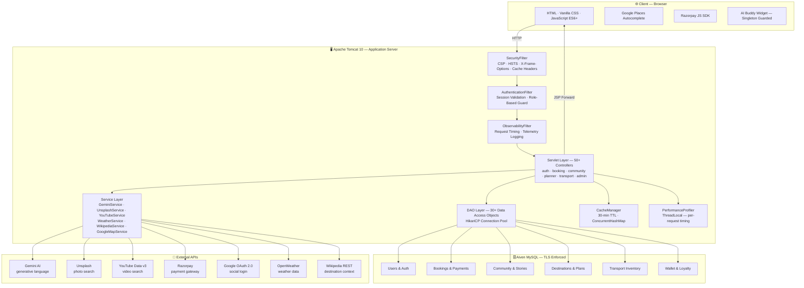

<div align="center">

<br/>


<br/><br/>

# ✈️ Voyastra — Travel Smarter

### *An AI-Powered, Full-Stack Travel Ecosystem — Built Without Shortcuts*

<br/>

[](https://openjdk.org/)
[](https://jakarta.ee/specifications/pages/)
[](https://jakarta.ee/specifications/servlet/)
[](https://www.mysql.com/)
[](https://tomcat.apache.org/)

[](https://developers.google.com/maps)
[](https://deepmind.google/technologies/gemini/)
[](https://razorpay.com/)
[](https://render.com/)
[](./LICENSE)

<br/>

[](#)
[](#)
[](#-project-statistics)
[](#-folder-structure)
[](#-apis--integrations)
[](https://github.com/krrrish111/Smart-Travel/stargazers)

<br/>

> ### 🌍 Book anything. Explore everywhere. Travel smarter with AI.

Voyastra is a **production-grade, full-stack AI travel platform** built entirely on pure Java Servlets and JSP — no Spring, no shortcuts. It books **flights, trains, buses, cabs, cruises, helicopters, hotels, and curated experiences**. It generates complete AI-powered itineraries via Gemini, powers a vibrant social travel community, and delivers a real-time admin dashboard — all under one roof.

<br/>

[🌐 **Live Demo**](https://voyastra.onrender.com) &nbsp;·&nbsp;
[📁 **Repository**](https://github.com/krrrish111/Smart-Travel) &nbsp;·&nbsp;
[📸 **Screenshots**](#-screenshots) &nbsp;·&nbsp;
[⚙️ **Installation**](#-installation) &nbsp;·&nbsp;
[🏗 **Architecture**](#-system-architecture) &nbsp;·&nbsp;
[👨‍💻 **Developer**](#-developer)

<br/>

</div>

---

## 📑 Table of Contents

| # | Section |
|---|---|
| 1 | [✨ Key Features](#-key-features) |
| 2 | [📸 Screenshots](#-screenshots) |
| 3 | [🎬 Demo Video](#-demo-video) |
| 4 | [🏗 System Architecture](#-system-architecture) |
| 5 | [🗄 Database Overview](#-database-overview) |
| 6 | [🔌 APIs & Integrations](#-apis--integrations) |
| 7 | [📂 Folder Structure](#-folder-structure) |
| 8 | [📊 Project Statistics](#-project-statistics) |
| 9 | [🚀 Installation](#-installation) |
| 10 | [⚙️ Environment Variables](#-environment-variables) |
| 11 | [▶️ Running the Project](#-running-the-project) |
| 12 | [🌐 Deployment](#-deployment) |
| 13 | [🔒 Security](#-security) |
| 14 | [🔮 Future Scope](#-future-scope) |
| 15 | [🤝 Contributing](#-contributing) |
| 16 | [📄 License](#-license) |
| 17 | [👨‍💻 Developer](#-developer) |

---

## ✨ Key Features

<details open>
<summary><strong>🤖 AI &amp; Intelligence</strong></summary>

<br/>

| Feature | Description |
|---|---|
| **AI Trip Planner** | Powered by Google Gemini — generates complete day-by-day itineraries from destination, budget, travel style, and dates. Includes activities, restaurants, hidden gems, and a full budget breakdown. Auto-fallbacks through `gemini-3.5-flash` → `gemini-3.1-flash-lite` — zero broken pages. |
| **AI Chat Assistant** | Glassmorphic floating chat widget, always visible at bottom-right. Context-aware — adapts suggestions to the current page (Flights, Hotels, Planner, Journey, Community). Lazy-loaded for performance. Singleton-guarded to prevent duplicates across navigation. |
| **Google Places Autocomplete** | Consistent, conditionally-loaded Places API across 15+ location input fields. Single `google-places.js` module — skipped entirely on pages without location inputs. |
| **Smart Unified Search** | One search interface across all travel verticals — flights, trains, buses, cabs, cruises, helicopters, hotels, destinations, and experiences. |
| **Interactive Maps** | Google Maps embedded on hotel details, destination pages, and experience pages — with nearby POI markers. |
| **Weather Integration** | Real-time weather data from OpenWeather API, surfaced on planner results and destination pages. |

</details>

<details open>
<summary><strong>✈️ Booking System</strong></summary>

<br/>

| Mode | Complete Booking Flow |
|---|---|
| **Flights** | Search → Details → Seat Selection → Traveller Details → Extras → Review → Razorpay → PDF Ticket → Email |
| **Hotels** | Search → Details (gallery, amenities, reviews) → Extras → Review → Razorpay → Voucher → PDF |
| **Trains** | Search → Results → Details → Passengers → Seat Selection → Payment → Ticket |
| **Buses** | Search → Visual Seat Map → Passengers → Payment → Ticket |
| **Cabs** | Route Search → Passenger Details → Payment → Digital Ticket |
| **Car Rentals** | Search → Customer Details → Payment → Ticket |
| **Cruises** | Search → Cabin Selection → Multi-Passenger → Payment → Ticket |
| **Helicopters** | Route Search → Passengers → Payment → Ticket |
| **Destination Packages** | Explore → Customize → Itinerary Review → Group Booking → Payment |
| **Experiences** | Browse → Activity Details → Local Guide Info → Book → Confirm |

</details>

<details open>
<summary><strong>🌐 Community &amp; Social</strong></summary>

<br/>

| Feature | Description |
|---|---|
| **Community Feed** | Dynamic post feed with stories bar, trending section, create and share. |
| **Travel Stories** | Instagram-style 24-hour stories with real-time view tracking. |
| **Reels** | Short-form travel video reels with full-screen immersive viewer. |
| **Hidden Gems** | Crowd-sourced undiscovered locations — user ratings, tags, and map pins. |
| **Food Discovery** | Local restaurant guides, cuisine discovery, and traveller reviews. |
| **Travel Guides** | Long-form user-authored destination guides with rich media. |
| **Creator Hub** | Content creator analytics dashboard — reach, engagement, and publishing tools. |
| **Travel Challenges** | Community challenges with leaderboard and participation tracking. |
| **Discover** | Personalized discovery feed based on travel history and interests. |
| **User Profiles** | Public traveller profile — posts, trip stats, followers, and following. |

</details>

<details open>
<summary><strong>👤 Profile &amp; Account</strong></summary>

<br/>

| Feature | Description |
|---|---|
| **Profile Dashboard** | Centralized view of all account activity — bookings, wishlist, saved plans, community posts, journey history. |
| **Booking Management** | Full history of all bookings across every mode — filter by status, download tickets, cancel, and re-book. |
| **Wallet** | In-app travel wallet — balance management, top-up, transaction history, and apply credit to bookings. |
| **Loyalty Points** | Earn points on every booking — redeem for discounts, upgrades, and exclusive perks. |
| **Wishlist** | Save hotels, destinations, experiences, and packages for later with a single click. |
| **Journey Tracker** | Live journey tracking — active trips, upcoming departures, and completed journey history. |
| **Saved Plans** | Bookmark AI-generated itineraries and custom plans for future reference. |
| **Notifications** | Real-time system notifications — booking updates, price alerts, and community mentions. |

</details>

<details open>
<summary><strong>🧳 Travel Center — Premium Services</strong></summary>

<br/>

| Service | Description |
|---|---|
| **Visa Assistant** | Destination-specific visa requirements, document checklists, and application guidance. |
| **Travel Insurance** | Trip cancellation, medical, and baggage loss — multiple plan tiers with instant quotes. |
| **Forex Center** | Foreign currency ordering with live exchange rate reference and home delivery options. |
| **eSIM Center** | International e-SIM data plans for 150+ countries — instant digital activation via QR code. |
| **Airport Services** | Premium lounge access, porter booking, meet and greet, and fast-track immigration. |

</details>

<details open>
<summary><strong>📊 Admin Dashboard</strong></summary>

<br/>

| Section | Description |
|---|---|
| **Analytics** | Real-time KPI cards — total users, bookings, revenue, and AI plans generated. Chart.js revenue trends, booking growth, and conversion rates. |
| **User Management** | View, search, filter, edit, suspend, and assign roles to all registered users. |
| **Booking Management** | Full cross-vertical booking registry — filter by mode, status, and date range. |
| **Payment Records** | All transaction logs, refund management, coupon usage, and revenue breakdown. |
| **Destination CMS** | Add, edit, and delete destination packages, photos, itineraries, and featured status. |
| **Community Moderation** | Review flagged posts, stories, and user reports. Remove harmful content. |
| **Review Management** | Moderate hotel and experience reviews — approve, reject, and flag. |
| **Observability Logs** | Request tracing, performance telemetry, error logs, and response times. |
| **System Settings** | Feature flags, system configuration, maintenance mode, and platform settings. |

</details>

<details open>
<summary><strong>🔒 Security &amp; Infrastructure</strong></summary>

<br/>

| Feature | Description |
|---|---|
| **Security Headers** | Full CSP, HSTS, X-Frame-Options: DENY, X-Content-Type-Options: nosniff, Referrer-Policy — applied to every request via `SecurityFilter`. |
| **Authentication** | Email/password (BCrypt), Google OAuth 2.0, email verification, and token-based password reset. |
| **Authorization** | Role-based route protection — `AuthenticationFilter` enforces session validity on every protected path. |
| **Responsive UI** | Mobile-first glassmorphic dark UI — smooth on phones, tablets, and desktops. |
| **Premium Dark Theme** | CSS variable-driven theming with an animated background slider, custom cursor, scroll progress indicator, and micro-animations throughout. |

</details>

---

## 📸 Screenshots

> Place screenshots in the `docs/screenshots/` directory using the exact filenames below.

---

### 🏠 Homepage


*Animated background image slider, glassmorphic hero card with AI planner CTA, featured destination grid, trending experiences, and the floating AI Buddy widget locked to the bottom-right corner.*

---

### 🧠 AI Trip Planner


*Planner input form — destination with Google Places Autocomplete, origin city, departure and return dates, budget slider, travel style selector (Adventure / Leisure / Luxury / Budget), and traveller count. Supports context pre-fill from homepage destination click.*

---

### 📋 Planner Result


*AI-generated itinerary — day-by-day schedule cards, Unsplash destination gallery (5 photos), embedded YouTube travel vlogs (3 videos), hidden gems map, restaurant recommendations, and an itemized budget breakdown by category. Powered by Gemini AI with automatic model fallback.*

---

### ✈️ Flight Search


*Flight search form — origin and destination with Google Places Autocomplete, one-way or return toggle, departure and return dates, cabin class selector, and adult/child/infant count. One-click swap button for reversing origin and destination.*

---

### ✈️ Flight Results


*Flight results listing — airline logo, route, departure and arrival times, duration, stop count, and price. Sortable by price, duration, and departure time. One-click select to proceed to seat selection.*

---

### 🏨 Hotel Search


*Hotel search — city destination with Google Places Autocomplete, check-in and check-out date pickers, and adult/child guest count. Filters for star rating, price range, and amenities.*

---

### 🏨 Hotel Details


*Hotel detail page — scrollable hero photo gallery, star rating, amenities icon grid, room type cards with pricing, embedded Google Map, verified guest reviews with ratings, and the multi-step checkout CTA. Wishlist heart toggle included.*

---

### 🎯 Experiences Explorer


*Experiences listing — activity cards with category filter chips (Adventure, Cultural, Wellness, Food and Drink). Each card displays duration, group size, price, and a local guide profile snippet.*

---

### 🗺️ Destination Explorer


*Destination explorer — hero cards for featured destinations with best-time-to-visit indicators, current weather badge, and top highlights. Click through to a full destination detail page with AI-generated itinerary preview.*

---

### 🌐 Community Feed


*Community feed — stories bar at the top with circular avatar rings, post cards with media (image and video), like, comment, and share actions, trending hashtags sidebar, and a fixed create-post floating action button.*

---

### 📖 Community Post


*Individual post view — full-width media display, rich caption with hashtag highlighting, threaded comment section, nested reply expansion, reaction counts, author profile card, and a related posts carousel.*

---

### 👤 Profile Dashboard


*User profile — avatar with edit overlay, cover photo, traveller stat chips (trips, countries visited, followers, following), and tab navigation for Posts, Saved Plans, Journey History, Bookings, and Wishlist.*

---

### 📋 My Bookings


*Booking management — chronological list of all bookings across every travel mode. Status badges (Confirmed, Pending, Cancelled). Per-booking actions: download ticket, view invoice, cancel booking, and re-book.*

---

### 🧳 Travel Center


*Travel Center dashboard — six premium service cards (Visa, Forex, e-SIM, Insurance, Airport Services, Dashboard Overview) with descriptive icons, brief service summaries, and direct navigation links.*

---

### 🛂 Visa Assistant


*Visa assistant — nationality and destination selectors to instantly surface visa type (e-Visa, on-arrival, embassy), processing time, required document checklist, official fees, and embassy contact details.*

---

### 🛡️ Travel Insurance


*Insurance plans — three tier comparison cards (Basic, Standard, Premium) with full coverage details, premium amounts, key add-ons, and a one-click instant quote and purchase flow.*

---

### 💱 Forex Center


*Forex center — indicative live exchange rates table, source and target currency selectors, order amount input with converted total preview, delivery address form, and estimated home delivery timeline.*

---

### 📱 eSIM Center


*eSIM center — country and region selector, available data plan cards (daily, weekly, monthly) with GB allowances and validity periods, purchase flow, and instant QR code delivered to registered email.*

---

### 🛫 Airport Services


*Airport services — lounge access booking with airport and terminal selector, meet and greet request form, porter scheduling with luggage count, and fast-track immigration pass purchasing.*

---

### 💼 Wallet


*In-app travel wallet — current balance card, top-up options, full transaction history with credit and debit rows, and quick-apply during checkout. Loyalty point balance displayed alongside wallet balance.*

---

### 📊 Admin Dashboard


*Admin dashboard — real-time KPI cards (total users, confirmed bookings, monthly revenue, AI plans generated), Chart.js monthly booking trend line chart, revenue breakdown bar chart, top-performing destinations table, and a recent activity feed.*

---

### 🤖 AI Chatbot


*AI Buddy widget — glassmorphic popup with context-aware recommendation chips (e.g., Compare Prices on transport pages, Create Itinerary on planner), full chat history, animated typing indicator, and natural language input. Draggable on desktop; fixed bottom-right on mobile.*

---

## 🎬 Demo Video

> **Tip:** Record a 60–90 second Loom or screen capture walkthrough and embed it below.

<!-- Replace the placeholder below with your actual video thumbnail and link -->

<div align="center">

[](https://youtube.com/YOUR_DEMO_LINK)

*Click the badge above to watch a full walkthrough of Voyastra — from AI trip planning to booking, payment, and community features.*

</div>

---

## 🏗 System Architecture



### Request Lifecycle

```
Browser Request
  │
  ▼
SecurityFilter        ──  CSP · HSTS · X-Frame-Options · Static asset Cache-Control
  │
  ▼
AuthenticationFilter  ──  Session validation · Role guard · Login redirect
  │
  ▼
ObservabilityFilter   ──  Start request timer · Log request metadata
  │
  ▼
Servlet               ──  Parse params · Orchestrate business logic
  ├── Service Layer   ──  External API calls (Gemini / Unsplash / YouTube / Razorpay)
  ├── DAO Layer       ──  Parameterized SQL → HikariCP → Aiven MySQL
  └── CacheManager    ──  Read-through cache · 30-min TTL · ConcurrentHashMap
  │
  ▼
JSP View              ──  JSTL template renders server-side HTML
  │
  ▼
Browser Response
```

### Performance Telemetry

`PerformanceProfiler` uses ThreadLocal storage to record stage-by-stage timing per request:

```
[PERF] Servlet=145ms | DAO=23ms | Gemini=4200ms | Unsplash=310ms | YouTube=280ms | TOTAL=4958ms
```

---

## 🗄 Database Overview

### Schema Groups

| Group | Core Tables | Purpose |
|---|---|---|
| **Users & Auth** | `users`, `user_sessions`, `email_verifications`, `password_resets` | Accounts, OAuth, session management |
| **Bookings** | `bookings`, `booking_extras`, `travellers`, `seat_selections` | Generic booking core across all modes |
| **Flights** | `flights`, `flight_bookings`, `boarding_passes` | Flight inventory and passenger records |
| **Hotels** | `hotels`, `hotel_rooms`, `hotel_bookings`, `hotel_reviews`, `hotel_wishlist` | Hotel catalog and guest management |
| **Transport** | `trains`, `buses`, `cabs`, `cars`, `cruises`, `helicopters` | Multi-modal transport inventory |
| **Payments** | `payments`, `coupons`, `invoices`, `refunds` | Financial ledger and promotional codes |
| **Wallet & Loyalty** | `user_wallet`, `wallet_transactions`, `loyalty_points`, `point_transactions` | In-app currency and rewards system |
| **Destinations** | `destinations`, `destination_packages`, `destination_itineraries` | Package catalog and editorial content |
| **Experiences** | `experiences`, `experience_bookings`, `local_guides` | Activity marketplace |
| **Community** | `posts`, `stories`, `story_views`, `likes`, `comments`, `follows`, `challenges` | Full social graph |
| **Planner** | `planner_requests`, `plans`, `trip_groups`, `saved_plans` | AI-generated itineraries |
| **Travel Center** | `visa_requests`, `insurance_purchases`, `forex_orders`, `esim_orders` | Premium service records |
| **System** | `notifications`, `system_settings`, `site_content`, `activity_logs` | Platform management |

### HikariCP Connection Pool — Production Configuration

```properties
maximumPoolSize         = 10
connectionTimeout       = 5000ms
validationTimeout       = 2000ms
leakDetectionThreshold  = 10000ms
sslMode                 = REQUIRED          # Aiven MySQL TLS enforcement
zeroDateTimeBehavior    = convertToNull
```

> **Auto-Bootstrap:** `SchemaBootstrap` creates all tables on first startup. No manual DDL scripts are required.

---

## 🔌 APIs & Integrations

| API | Purpose | Authentication | Used In |
|---|---|---|---|
| 🤖 **Google Gemini AI** | AI itinerary generation | API Key | `GeminiService.java` (69 KB) |
| 🗺️ **Google Maps Places** | Location autocomplete and maps | API Key (JS) | `google-places.js` |
| 🔵 **Google OAuth 2.0** | Social login | OAuth 2.0 | `GoogleLoginServlet.java` |
| 📷 **Unsplash** | Destination photography | API Key | `UnsplashService.java` |
| 🎬 **YouTube Data v3** | Travel vlog discovery | API Key | `YouTubeService.java` |
| 📖 **Wikipedia REST** | Destination context and summaries | None | `WikipediaService.java` (9.4 KB) |
| 🌤️ **OpenWeather** | Real-time weather data | API Key | `WeatherService.java` |
| 💳 **Razorpay** | Payment gateway | Key + Secret | `ProcessPaymentServlet.java` (17 KB) |
| 🗄️ **Aiven MySQL** | Cloud database | Credentials + TLS | `DBConnection.java` |

---

## 📂 Folder Structure

<details>
<summary><strong>Click to expand the complete project tree</strong></summary>

```
voyastra/
│
├── pom.xml                                    Maven build — Java 17, Tomcat 10
├── README.md
│
├── src/main/java/com/voyastra/
│   │
│   ├── api/                                   REST API endpoint handlers
│   │
│   ├── config/
│   │   └── ConfigManager.java                 Environment variable resolution (env > properties)
│   │
│   ├── controller/                            50+ HTTP Servlets
│   │   ├── admin/                             Analytics, users, bookings, logs, settings
│   │   ├── auth/                              LoginServlet, RegisterServlet, GoogleLoginServlet
│   │   │                                      ForgotPasswordServlet, ResetPasswordServlet
│   │   ├── booking/                           37 Servlets
│   │   │                                      FlightDetailsServlet, SeatSelectionServlet
│   │   │                                      HotelCheckoutServlet, HotelPaymentServlet (14 KB)
│   │   │                                      ProcessPaymentServlet (17 KB), TravellerDetailsServlet
│   │   │                                      BookingExtrasServlet, ReviewBookingServlet
│   │   │                                      TicketServlet, InvoiceServlet, SendTicketServlet
│   │   ├── community/                         Posts, Stories, Likes, Comments, Follows
│   │   ├── payment/                           Razorpay webhook, coupon, refund
│   │   ├── planner/
│   │   │   └── PlannerServlet.java            13-stage AI pipeline orchestrator
│   │   ├── transport/                         Train, Bus, Cab, Car, Cruise, Helicopter
│   │   ├── travelcenter/                      Visa, Forex, Insurance, eSIM, Airport
│   │   ├── profile/                           Profile, Wallet, Loyalty, Wishlist
│   │   ├── HomeServlet.java                   Homepage orchestration (11 KB)
│   │   └── SearchServlet.java                 Unified multi-vertical search (31 KB)
│   │
│   ├── dao/                                   30+ Data Access Objects
│   │   ├── booking/                           BookingDAO, HotelDAO, FlightDAO, StayDAO
│   │   ├── community/                         PostDAO, CommentDAO, LikeDAO, StoryDAO
│   │   ├── destination/                       DestinationDAO (CacheManager-backed)
│   │   ├── transport/                         TrainDAO, BusDAO, CabDAO, CruiseDAO
│   │   ├── payment/                           PaymentDAO, CouponDAO, WalletDAO
│   │   ├── DashboardDAO.java                  Consolidated analytics (2 batch queries — 86% faster)
│   │   └── NotificationDAO.java
│   │
│   ├── filter/
│   │   ├── SecurityFilter.java                CSP, HSTS, X-Frame-Options, nosniff (9.3 KB)
│   │   ├── AuthenticationFilter.java          Session guard, role enforcement
│   │   ├── ObservabilityFilter.java           Request and response telemetry
│   │   └── GlobalExceptionFilter.java         Centralized error handling
│   │
│   ├── model/                                 30+ Java POJO domain objects
│   │
│   ├── service/
│   │   ├── GeminiService.java                 AI itinerary generation with model fallback (69 KB)
│   │   ├── UnsplashService.java               Destination photography (5 per plan)
│   │   ├── YouTubeService.java                Travel vlog discovery (3 per plan)
│   │   ├── WeatherService.java                Real-time weather data
│   │   ├── WikipediaService.java              Destination context (9.4 KB)
│   │   ├── GoogleMapService.java              Nearby places search
│   │   ├── NearbySearchService.java           Point-of-interest search around destination
│   │   └── BudgetCalculationEngine.java       Dynamic budget breakdown
│   │
│   └── util/
│       ├── DBConnection.java                  HikariCP pool — production tuned
│       ├── CacheManager.java                  In-memory 30-min TTL cache (ConcurrentHashMap)
│       └── PerformanceProfiler.java           ThreadLocal per-request timing recorder
│
└── src/main/webapp/
    │
    ├── admin/                                 Admin panel JSPs + dedicated CSS and JS
    │   ├── index.jsp                          Dashboard — KPIs + Chart.js (12 KB)
    │   ├── bookings.jsp, users.jsp, payments.jsp
    │   ├── community.jsp, reviews.jsp, destinations.jsp
    │   └── logs.jsp, content.jsp, settings.jsp
    │
    ├── assets/
    │   ├── css/
    │   │   ├── theme.css                      CSS custom properties — dark and light tokens
    │   │   ├── components.css                 Reusable UI component library
    │   │   ├── ai-buddy.css                   Glassmorphic chat widget styles
    │   │   ├── community_feed.css             Social feed card styles
    │   │   └── responsive.css                 Mobile-first breakpoints
    │   └── js/
    │       ├── ai-buddy.js                    Chat widget — drag-snap, context detection
    │       ├── google-places.js               Autocomplete — conditional load guard
    │       ├── community_feed.js              Dynamic feed rendering and lazy images
    │       └── main.js                        Global UI interactions
    │
    ├── components/                            Shared JSP fragments
    │   ├── header.jsp                         Nav, meta, global CSS and JS links
    │   ├── footer.jsp                         Footer — canonical AI Buddy include point
    │   ├── global_ui.jsp                      Background slider, cursor, scroll bar, toast system
    │   ├── ai-buddy.jsp                       Widget HTML — window.voyastraBuddyInitialized guard
    │   └── booking-stepper.jsp                Multi-step booking progress indicator
    │
    ├── pages/
    │   ├── auth/                              login, register, forgot-password, reset-password
    │   ├── booking/                           24 JSPs — full flows for all booking verticals
    │   ├── community/                         9 JSPs — feed, reels, guides, hidden-gems, creator-hub
    │   ├── destination/                       8 JSPs — explore, details, customize, booking
    │   ├── planner/                           12 JSPs — form, result, itinerary, trip, debug
    │   ├── profile/                           profile, settings, bookings, wishlist, journey
    │   ├── transport/                         46 JSPs — 7 modes x complete booking flow
    │   └── travelcenter/                      6 JSPs — dashboard, visa, forex, esim, insurance, airport
    │
    └── WEB-INF/
        ├── web.xml                            Servlet and filter registration
        └── views/                             Flight details, itinerary shared views
```

</details>

---

## 📊 Project Statistics

| Metric | Value |
|---|---|
| Java Source Files | **415** |
| HTTP Servlets | **50+** |
| JSP Pages | **100+** |
| Data Access Objects | **30+** |
| Transport Booking JSPs | **46** — 7 modes × complete flow |
| Booking-Specific Servlets | **37** |
| External APIs Integrated | **9** |
| CSS Stylesheets | **15+** |
| Admin Dashboard Sections | **12** |
| Largest Service File | `GeminiService.java` — **69 KB** |
| Largest Servlet | `SearchServlet.java` — **31 KB** |
| Admin Query Optimization | 16 DB round-trips → 2 batch queries — **86% latency reduction** |
| Screenshot Gallery | **21 screens** covering every major feature |

---

## 🚀 Installation

### Prerequisites

```
  Java Development Kit (JDK) 17 or higher
  Apache Maven 3.9+
  Apache Tomcat 10.x
  MySQL 8.0+ — local instance or Aiven cloud account
  IDE — IntelliJ IDEA Ultimate (recommended) or Eclipse
```

### Step 1 — Clone

```bash
git clone https://github.com/krrrish111/Smart-Travel.git
cd Smart-Travel
```

### Step 2 — Configure Environment

Set the variables from the [Environment Variables](#-environment-variables) section in your system or shell profile.

### Step 3 — Create the Database

```sql
CREATE DATABASE voyastra
  CHARACTER SET utf8mb4
  COLLATE utf8mb4_unicode_ci;
```

> Schema tables are **auto-created on first startup** by `SchemaBootstrap`. No DDL scripts need to be run manually.

### Step 4 — Build

```bash
mvn clean package -DskipTests
```

Expected output:

```
[INFO] Building war: target/voyastra.war
[INFO] BUILD SUCCESS
[INFO] Total time: ~50s
```

### Step 5 — Deploy

```bash
cp target/voyastra.war $CATALINA_HOME/webapps/
$CATALINA_HOME/bin/startup.sh
tail -f $CATALINA_HOME/logs/catalina.out
```

### Step 6 — Verify

```bash
curl http://localhost:8080/voyastra/health
# Expected: {"status":"ok","db":"connected"}
```

Open **[http://localhost:8080/voyastra](http://localhost:8080/voyastra)** in your browser.

---

## ⚙️ Environment Variables

> ⚠️ **Never commit real credentials.** Use system environment variables or your platform's secrets vault.

| Variable | Required | Description |
|---|---|---|
| `DB_HOST` | ✅ Required | MySQL hostname — e.g. `mysql-xyz.aiven.io` |
| `DB_PORT` | ✅ Required | MySQL port — typically `3306` |
| `DB_NAME` | ✅ Required | Database name — `voyastra` |
| `DB_USER` | ✅ Required | Database username |
| `DB_PASSWORD` | ✅ Required | Database password |
| `GEMINI_API_KEY` | ✅ Required | Google Gemini AI API key |
| `GOOGLE_CLIENT_ID` | ✅ Required | Google OAuth 2.0 client ID |
| `GOOGLE_CLIENT_SECRET` | ✅ Required | Google OAuth 2.0 client secret |
| `GOOGLE_MAPS_API_KEY` | ✅ Required | Google Maps and Places API key |
| `UNSPLASH_ACCESS_KEY` | ✅ Required | Unsplash API access key |
| `YOUTUBE_API_KEY` | ✅ Required | YouTube Data API v3 key |
| `RAZORPAY_KEY_ID` | ✅ Required | Razorpay public key ID |
| `RAZORPAY_KEY_SECRET` | ✅ Required | Razorpay secret key |
| `OPENWEATHER_API_KEY` | ⚡ Optional | OpenWeather API key |
| `SMTP_HOST` | ⚡ Optional | SMTP server host for email delivery |
| `SMTP_USER` | ⚡ Optional | SMTP username or sender address |
| `SMTP_PASSWORD` | ⚡ Optional | SMTP authentication password |

**Resolution order — highest to lowest priority:**

```
System Environment Variables
  → Render Dashboard Environment Panel
    → WEB-INF/config.properties    ← never commit with real values
```

---

## ▶️ Running the Project

### Option A — Maven Tomcat Plugin (Fastest for development)

```bash
mvn clean compile tomcat7:run
```

Access at: **[http://localhost:8080/voyastra](http://localhost:8080/voyastra)**

### Option B — Manual WAR Deployment

```bash
# Build
mvn clean package -DskipTests

# Deploy
cp target/voyastra.war $CATALINA_HOME/webapps/

# Start
$CATALINA_HOME/bin/startup.sh

# Watch logs
tail -f $CATALINA_HOME/logs/catalina.out
```

### Option C — Compile Only (verify, no server)

```bash
mvn clean compile
# Validates all 415 Java source files — no server required
```

### Health Check

```bash
curl -s http://localhost:8080/voyastra/health
# Response: {"status":"ok","db":"connected"}
```

---

## 🌐 Deployment

### Render (Current Production Platform)

1. Push code to **GitHub**
2. Connect repository on [render.com](https://render.com)
3. Configure build settings:

   | Setting | Value |
   |---|---|
   | Build Command | `mvn clean package -DskipTests` |
   | Health Check Path | `/health` |

4. Add all [environment variables](#-environment-variables) in the Render dashboard
5. Every push to `main` triggers an automatic redeploy

### VPS or Cloud Server

```bash
# Build locally or on CI
mvn clean package -DskipTests

# Transfer WAR
scp target/voyastra.war user@your-server.com:/opt/tomcat/webapps/

# Restart Tomcat
ssh user@your-server.com "sudo systemctl restart tomcat10"

# Verify deployment
curl https://your-domain.com/voyastra/health
```

### Aiven MySQL (Cloud Database)

1. Create a free MySQL cluster at [console.aiven.io](https://console.aiven.io)
2. Download the CA certificate from the Aiven console
3. Set `DB_HOST`, `DB_PORT`, `DB_USER`, `DB_PASSWORD`, and `DB_NAME`
4. TLS is enforced automatically via `sslMode=REQUIRED` in `DBConnection.java`

---

## 🔒 Security

### HTTP Security Headers — Applied on Every Request via `SecurityFilter.java` (9.3 KB)

```http
Content-Security-Policy:   default-src 'self'; script-src 'self' 'nonce-{dynamic}' ...
Strict-Transport-Security: max-age=31536000; includeSubDomains
X-Frame-Options:           DENY
X-Content-Type-Options:    nosniff
Referrer-Policy:           strict-origin-when-cross-origin
Cache-Control:             public, max-age=31536000  (static assets only)
```

### Authentication Methods

| Method | Implementation |
|---|---|
| Email and Password | BCrypt hashed — no plaintext stored at any point |
| Google OAuth 2.0 | Full authorization code flow via `GoogleLoginServlet` |
| Email Verification | Secure time-limited token sent on registration |
| Password Reset | Single-use token — expires after 1 hour |

### Database Security

- **Aiven MySQL** — TLS enforced on all connections via `sslMode=REQUIRED`
- **100% parameterized queries** — zero raw string SQL concatenation, zero SQL injection surface
- **HikariCP leak detection** — connection leaks detected and logged after 10 seconds

### Session Security

- `AuthenticationFilter` validates session state on every protected route
- Sessions invalidated immediately on logout via `LogoutServlet`
- Admin routes are separated with double-gated role enforcement

---

## 🔮 Future Scope

| Priority | Feature | Notes |
|---|---|---|
| 🔴 High | **React Native Mobile App** | iOS and Android — same Java backend |
| 🔴 High | **Real-Time Notifications** | WebSocket push — `websocket/` package already scaffolded |
| 🔴 High | **Flight Price Alerts** | Background worker with email and push notification on price drop |
| 🟡 Medium | **Group Trip Collaboration** | Shared itineraries, split costs, group voting |
| 🟡 Medium | **AI Packing List Generator** | Destination, weather, and duration-aware suggestions |
| 🟡 Medium | **Multi-Currency Support** | Live FX rates, local currency billing at checkout |
| 🟡 Medium | **Points Marketplace** | Redeem loyalty points across all booking modes and partners |
| 🟡 Medium | **Trip Cost Splitting** | Bill splitting for group bookings with individual payment links |
| 🟢 Low | **Progressive Web App** | Offline support via service workers |
| 🟢 Low | **Voice Search** | Google Speech API integration on search inputs |
| 🟢 Low | **AR Destination Previews** | Camera overlay of destination highlights and landmarks |
| 🟢 Low | **Kubernetes Deployment** | Horizontal pod autoscaling for production traffic spikes |

---

## 🤝 Contributing

Contributions, bug reports, and feature requests are welcome.

```bash
# 1. Fork the repository on GitHub

# 2. Create your feature branch
git checkout -b feature/your-feature-name

# 3. Make your changes and commit
git commit -m "feat: describe your change clearly"

# 4. Push the branch
git push origin feature/your-feature-name

# 5. Open a Pull Request on GitHub
```

**Contribution Guidelines:**

- Follow the existing code style — Servlet + JSP pattern, no Spring Framework
- Do not commit credentials, `.class` files, or `target/` directories
- Add inline comments for complex business logic and DAO queries
- Verify your changes compile cleanly with `mvn clean compile` before submitting

---

## 📄 License

This project is licensed under the **MIT License**.

```
MIT License — Copyright (c) 2026 Voyastra

Permission is hereby granted, free of charge, to any person obtaining a copy
of this software and associated documentation files (the "Software"), to deal
in the Software without restriction, including without limitation the rights
to use, copy, modify, merge, publish, distribute, sublicense, and/or sell
copies of the Software, and to permit persons to whom the Software is
furnished to do so, subject to the following conditions:

The above copyright notice and this permission notice shall be included in
all copies or substantial portions of the Software.

THE SOFTWARE IS PROVIDED "AS IS", WITHOUT WARRANTY OF ANY KIND, EXPRESS OR
IMPLIED, INCLUDING BUT NOT LIMITED TO THE WARRANTIES OF MERCHANTABILITY,
FITNESS FOR A PARTICULAR PURPOSE AND NONINFRINGEMENT.
```

Third-party services — Google APIs, Razorpay, Unsplash, Aiven — are governed by their respective Terms of Service.

See [LICENSE](./LICENSE) for the complete license text.

---

## 👨‍💻 Developer

<div align="center">

<br/>


<br/><br/>

### Krish

*Full-Stack Java Engineer &nbsp;·&nbsp; AI Integration &nbsp;·&nbsp; System Architecture*

<br/>

[](https://github.com/krrrish111)
[](https://linkedin.com/in/YOUR_LINKEDIN_HERE)
[](https://YOUR_PORTFOLIO_HERE)
[](mailto:YOUR_EMAIL_HERE)

<br/>

</div>

---

## 📸 Screenshot Filename Reference

> Use this table as a checklist when capturing and organizing screenshots.

| File | Screen | Key Elements to Capture |
|---|---|---|
| `docs/screenshots/homepage.png` | Homepage | BG slider, hero card, featured destinations, AI Buddy widget |
| `docs/screenshots/planner.png` | AI Planner form | Places Autocomplete, budget slider, travel style chips |
| `docs/screenshots/planner-result.png` | Planner result | Day-by-day cards, Unsplash gallery, YouTube embeds, budget table |
| `docs/screenshots/flights.png` | Flight search | Origin/destination swap, date pickers, cabin class |
| `docs/screenshots/flight-results.png` | Flight results | Airline list, price sort, select CTA |
| `docs/screenshots/hotels.png` | Hotel search | Location autocomplete, date range, guest count |
| `docs/screenshots/hotel-details.png` | Hotel detail | Gallery, amenities, rooms, map, reviews, wishlist |
| `docs/screenshots/experiences.png` | Experiences | Category filters, activity cards, guide profiles |
| `docs/screenshots/destination-explorer.png` | Destination explorer | Featured cards, weather badge, highlights |
| `docs/screenshots/community.png` | Community feed | Stories bar, posts, trending sidebar |
| `docs/screenshots/community-post.png` | Community post | Full media, comments, reactions, author card |
| `docs/screenshots/profile.png` | Profile dashboard | Avatar, stats, tab nav, posts grid |
| `docs/screenshots/bookings.png` | My bookings | Status badges, download, cancel, re-book |
| `docs/screenshots/travel-center.png` | Travel Center | Six service cards with icons |
| `docs/screenshots/visa-assistant.png` | Visa assistant | Nationality selector, requirements table |
| `docs/screenshots/insurance.png` | Insurance plans | Three-tier comparison cards |
| `docs/screenshots/forex.png` | Forex center | Currency selector, rate table, order form |
| `docs/screenshots/esim.png` | eSIM center | Country selector, data plans, QR delivery |
| `docs/screenshots/airport-services.png` | Airport services | Lounge, porter, meet and greet forms |
| `docs/screenshots/wallet.png` | Wallet | Balance card, top-up, transaction history |
| `docs/screenshots/admin-dashboard.png` | Admin dashboard | KPI cards, Chart.js charts, activity feed |
| `docs/screenshots/chatbot.png` | AI Buddy widget | Glassmorphic popup, context chips, chat history |

---

<div align="center">

<br/>

**Built with ❤️ and ☕ — powered by Gemini AI, pure Java Servlets, and a deep love for travel.**

<br/>

*If Voyastra impressed you, sparked an idea, or helped your journey — a ⭐ star means everything.*

<br/>

[](https://github.com/krrrish111/Smart-Travel/stargazers)
&nbsp;&nbsp;
[](https://github.com/krrrish111/Smart-Travel/network/members)

<br/>

<sub>© 2026 Voyastra — Travel Smarter</sub>

<br/>

</div>
